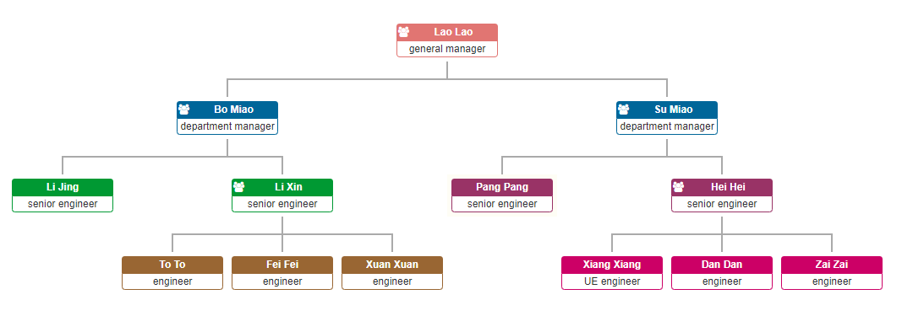

# Jquery-OrgChart
该插件为画组织架构图插件，通过OrgChart API定义的数据接口以json的数据形式将自己想要的组织架构数据传给orgChart，上手难度低，可扩展性比较高。

### 支持ul，json, ajax数据源；

用户可以对展开/折叠结果图中的节点；

用户可以设置结构图的朝向；

用户可以通过拖拽节点到其他节点来改变图的结构；

用户可以对图中的节点进行增删节点，并导出最终的结构关系；

支持导出结构图为png图片；

支持对结构图的缩放和平移

## 示例代码
```
var datascource = {
    'id': '1',
    'name': 'Lao Lao',
    'title': 'general manager',
    'children': [{
        'id': '2',
        'name': 'Bo Miao',
        'title': 'department manager'
    },
    {
        'id': '3',
        'name': 'Su Miao',
        'title': 'department manager',
        'children': [{
            'id': '4',
            'name': 'Tie Hua',
            'title': 'senior engineer'
        },
        {
            'id': '5',
            'name': 'Hei Hei',
            'title': 'senior engineer',
            'children': [{
                'id': '6',
                'name': 'Pang Pang',
                'title': 'engineer'
            },
            {
                'id': '7',
                'name': 'Xiang Xiang',
                'title': 'UE engineer'
            }]
        }]
    },
    {
        'id': '8',
        'name': 'Yu Jie',
        'title': 'department manager'
    },
    {
        'id': '9',
        'name': 'Yu Li',
        'title': 'department manager'
    },
    {
        'id': '10',
        'name': 'Hong Miao',
        'title': 'department manager'
    },
    {
        'id': '11',
        'name': 'Yu Wei',
        'title': 'department manager'
    },
    {
        'id': '12',
        'name': 'Chun Miao',
        'title': 'department manager'
    },
    {
        'id': '13',
        'name': 'Yu Tie',
        'title': 'department manager'
    }]
};
$('#chart-container').orgchart({
    'data': datascource,
    'nodeContent': 'title',
    'nodeID': 'id',
    'createNode': function($node, data) {
        var secondMenuIcon = $('<i>', {
            'class': 'fa fa-info-circle second-menu-icon',
            click: function() {
                $(this).siblings('.second-menu').toggle();
            }
        });
        var secondMenu = '<div class="second-menu"></div>';
        $node.append(secondMenuIcon).append(secondMenu);
    }
});
```
#### 使用Ajax远程数据
通过Ajax来调用远程的数据作为组织结构图表的数据源
```
$('#chart-container').orgchart({
  'data' : '/orgchart/initdata',
  'depth': 2,
  'nodeTitle': 'name',
  'nodeContent': 'title'
});
```
#### 延迟加载数据
包含四个属性：parent、children、sibling、families
```
var datascource = {
  'id': '1',
  'name': 'Su Miao',
  'title': 'department manager',
  'relationship': { 'children_num': 2, 'parent_num': 1,'sibling_num': 2 },
  'children': [
    { 'id': '2','name': 'Tie Hua', 'title': 'senior engineer', 
      'relationship': { 'children_num': 0, 'parent_num': 1,'sibling_num': 1 }},
    { 'id': '3','name': 'Hei Hei', 'title': 'senior engineer', 
      'relationship': { 'children_num': 2, 'parent_num': 1,'sibling_num': 1 }}
  ]
};
  
var ajaxURLs = {
  'children': '/orgchart/children/',
  'parent': '/orgchart/parent/',
  'siblings': '/orgchart/siblings/',
  'families': '/orgchart/families/'
};
  
$('#chart-container').orgchart({
  'data' : datascource,
  'ajaxURL': ajaxURLs,
  'nodeTitle': 'name',
  'nodeContent': 'title',
  'nodeId': 'id'
});
```
——更多操作请查看代码实例
